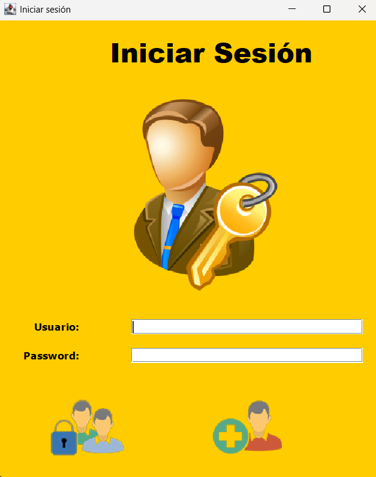

# Login de Usuarios con Java Swing 🔐

_Autor: Saul Echeverri_   
_Edición: 2024_



## Tabla de Contenidos 📚

- [Comenzando](#comenzando)
  - [Pre-requisitos](#pre-requisitos)
  - [Instalación](#instalación)
    - [Requisitos Previos](#requisitos-previos)
    - [Clonar el Repositorio](#clonar-el-repositorio)
  - [Despliegue](#despliegue)
    - [Despliegue Local](#despliegue-local)
- [Construido con](#construido-con)
- [Contribuyendo](#contribuyendo)
  - [Reglas para Enviar Solicitudes de Extracción (Pull Requests)](#reglas-para-enviar-solicitudes-de-extracción-pull-requests-)
  - [Informar Problemas](#informar-problemas)
  - [Comunicación](#comunicación)
  - [¿Dónde obtener ayuda?](#dónde-obtener-ayuda)
- [Autor](#autor)
- [Licencia](#licencia)
- [Expresiones de Gratitud](#expresiones-de-gratitud)
- [Créditos](#créditos)


...

## Comenzando 🚀

Este proyecto es una aplicación **Java Swing** para login y registro de usuarios con persistencia en base de datos PostgreSQL.

Diseñado con fines educativos para practicar **GUI con Java**, conexión con bases de datos mediante JDBC y estructura básica de proyectos en IntelliJ IDEA.

Se basa en el curso de **Java y MySQL** de **La Tecnologia Avanza de Cristian** publicado en 
la plataforma de Youtube 

Este repositorio es de carácter **Educativo** con fines de estudio sobre la iniciación del aprendizaje de la 
**integración con bases de datos**.


### Pre-requisitos 📋

_Programas y herramientas necesarias:_
- Java JDK 17 o superior
- PostgreSQL
- IntelliJ IDEA (u otro IDE compatible con Java)
- Conexión a Internet para descargar dependencias vía Maven

### Instalación 🔧

A continuación, se describen los pasos para configurar y ejecutar este proyecto Java en tu entorno de desarrollo.

#### Requisitos Previos
Antes de comenzar, asegúrate de tener los siguientes requisitos previos en tu sistema:

- Java Development Kit (JDK):** Debes tener instalado Java Development Kit (JDK) en tu sistema. Este proyecto requiere 
JDK 17 o una versión superior. Puedes descargar y configurar JDK desde el sitio oficial de [Oracle](https://www.oracle.com/java/technologies/javase-downloads.html) o [OpenJDK](https://adoptopenjdk.net/).

   Para verificar si Java está instalado, puedes abrir una terminal y ejecutar el siguiente comando:

   ```shell
   java -version

- **PostgreSQL**: Asegúrate de tener PostgreSQL instalado en tu sistema. Puedes obtener más información en su [sitio oficial](https://www.postgresql.org/download/).
- Agregar el driver PostgreSQL al classpath (por ejemplo con Maven: `postgresql:42.7.3`)

- **Git**: instalalo en su sitio oficial [Git](https://git-scm.com/) si deseas clonar el repositorio.

#### Clonar el Repositorio

Para comenzar, clona este repositorio en tu máquina local usando Git:

```shell
git clone https://github.com/saulolo/login-java-swing.git
cd login-java-swing
```

**Nota:**  Asegúrate de que tu sistema tenga configuradas las variables de entorno JAVA_HOME y PATH para que apunten a 
tu instalación de JDK.

- Configurar base de datos `bd_person_la_tec_avanz` con una tabla `registros(id integer, usuario varchar, contrasena varchar)`


## Despliegue 📦

En esta sección, se proporcionan instrucciones y notas adicionales sobre cómo llevar tu proyecto a un entorno de 
producción o cómo desplegarlo para su uso.

### Despliegue Local 🏠

Si deseas ejecutar tu proyecto en tu propio entorno local para pruebas o desarrollo, sigue estos pasos generales:

1. **Configura PostgreSQLs**: Asegúrate de tener una base de datos PostgreSQL funcionando. Crea una base de datos con 
el nombre `bd_person_la_tec_avanz`.

2. **Verificar**: que el archivo `Conexion.java` tiene la URL correcta: `bd_person_la_tec_avanz`.
```java
jdbc:postgresql://localhost:5432/bd_person_la_tec_avanz
```
3. **Configuración de Variables de Entorno**: Asegúrate de que las variables de entorno necesarias, como `JAVA_HOME`, 
estén configuradas correctamente.

4. **Compilación y Ejecución**: Para compilar y ejecutar el proyecto localmente usando Maven ejecuta el siguiente comando:
```shell
mvn clean install
```
5. **Ejecución**: Ejecutar la clase `Main.java` que lanza la ventana de login.

6. **Registrar**: Registrar un nuevo usuario y luego iniciar sesión con él.

El proyecto se ejecutará en tu servidor local en http://localhost:8080.

### 🧩 Script SQL para la Base de Datos

Este proyecto incluye un archivo SQL que crea la base de datos y la tabla necesarias para el login de usuarios.

📄 **Archivo incluido:**  
`src/main/resources/db_sql/bd_person_la_tec_avanz.sql`

🔧 **¿Qué hace este script?**

- Crea la base de datos `bd_person_la_tec_avanz` si no existe.
- Crea la tabla `registros` con los campos:
  - `id` (entero, clave primaria)
  - `usuario` (cadena única)
  - `contrasena` (cadena únicas)
- Añade una restricción `UNIQUE` al campo `usuario` para evitar duplicados.

📌 **Instrucciones para ejecutarlo desde DBeaver (PostgreSQL):**

1. Abre DBeaver y conéctate a tu servidor de PostgreSQL.
2. Si no existe la base de datos `bd_person_la_tec_avanz`, créala:
  - Haz clic derecho sobre el servidor > **Create > Database**
  - Nómbrala: `bd_person_la_tec_avanz`

3. Haz clic derecho sobre la nueva base de datos > **SQL Editor > Open SQL Script**

4. Copia y pega el contenido del archivo `bd_person_la_tec_avanz.sql` o ábrelo desde el explorador con `File > Open File`.

5. Ejecuta el script completo haciendo clic en el botón ▶️ o presionando `Ctrl + Enter`.

📝 **Ejemplo del contenido del archivo `.sql`:**

```sql
-- Crear la base de datos (si aún no la has creado desde DBeaver)
-- CREATE DATABASE bd_person_la_tec_avanz;

-- Conectar a la base de datos
-- \c bd_person_la_tec_avanz

-- Crear tabla 'registros'
CREATE TABLE IF NOT EXISTS registros (
    id SERIAL PRIMARY KEY,
    usuario VARCHAR(50) UNIQUE NOT NULL,
    contrasena VARCHAR(50) NOT NULL
);
```

## Construido con 🛠️

Este proyecto fue construido utilizando las siguientes herramientas y tecnologías:

* **Java y Swing**: El lenguaje de programación principal utilizado en el proyecto.
* **PostgreSQL**: Sistema de gestión de bases de datos relacional utilizado para almacenar los datos de la tienda.
* **Maven**: Gestor de dependencias que se utilizó para administrar las bibliotecas y las dependencias del proyecto. 
Puedes encontrar más información sobre Maven en [https://maven.apache.org/](https://maven.apache.org/).


## Contribuyendo 🖇️

¡Gracias por tu interés en contribuir a este proyecto! Aquí hay algunas reglas y pautas para enviar contribuciones:

### Reglas para Enviar Solicitudes de Extracción (Pull Requests) 🔀

1. Antes de enviar una solicitud de extracción, asegúrate de que tu código esté bien probado y sea compatible con la 
rama principal.

2. Sigue un estilo de código consistente.

3. Si tu contribución agrega nuevas características, proporciona documentación clara sobre cómo utilizar esas 
características.

### Informar Problemas 🐞

Si encuentras errores o problemas en el proyecto, por favor, abre un issue para informarnos. Proporciona detalles claros 
sobre el problema, incluyendo pasos para reproducirlo.

### Comunicación 💬

Me encanta escuchar tus ideas y responder tus preguntas. Siempre puedes [contactarme](https://www.linkedin.com/in/saul-echeverri-duque/) para discutir el proyecto o plantear cualquier pregunta que tengas.

¡Esperamos que te unas a nuestra comunidad de contribuyentes y esperamos tus valiosas contribuciones!

### ¿Dónde obtener ayuda? 🆘

Si tienes preguntas o necesitas ayuda durante el proceso de contribución, no dudes en [contactarme](https://www.linkedin.com/in/saul-echeverri-duque/) o abrir un issue para obtener asistencia.

¡Espero trabajar contigo en este proyecto y agradecemos tu ayuda para mejorarlo!


## Autor ✒️

¡Hola! Soy Saul Echeverri Duque 👨‍💻 , el creador y desarrollador de este proyecto. Permíteme compartir un poco sobre mi 
formación y experiencia:

### Formación Académica 📚

- 🎓 Graduado en Ingeniería de Alimentos por la Universidad de Antioquia, Colombia.
- 📖 Titulado en Tecnología en Análisis y Desarrollo de Software por el SENA.

### Trayectoria Profesional 💼

- 👨‍💻 Cuento con más de dos año de experiencia laboral en el campo del desarrollo de software.
- 🌟 Durante mi trayectoria, he tenido el privilegio de trabajar en diversos proyectos tecnológicos, donde he aplicado 
mis conocimientos en programación y análisis.
- 🏢 Actualmente, formo parte de [IAS Software](https://www.ias.com.co/), una empresa de software en Medellín, Colombia, 
donde sigo creciendo profesionalmente y contribuyendo al mundo de la tecnología.

### Pasión por la Programación 🚀

- 💻 Mi viaje en el mundo de la programación comenzó en el 2021, y desde entonces, he estado inmerso en el emocionante 
universo del desarrollo de software.
- 📚 Uno de mis mayores intereses y áreas de enfoque es Java, y este proyecto es el resultado de mi deseo de compartir 
conocimientos y experiencias relacionadas con este lenguaje.
- 🤝 Estoy emocionado de colaborar y aprender junto a otros entusiastas de Java.

Estoy agradecido por la oportunidad de compartir este proyecto contigo y espero que te sea útil en tu propio camino de 
aprendizaje y desarrollo. Si tienes alguna pregunta, sugerencia o simplemente quieres charlar sobre tecnología, no dudes 
en ponerte en contacto conmigo. ¡Disfruta explorando el mundo de Java!

¡Gracias por ser parte de este proyecto! 😊


## Licencia 📄

Este proyecto se basa en el curso "Java y MySQL de La Tecnologia Avanza" de Cristian y se 
desarrolla con fines educativos y de aprendizaje del lenguaje de Java. La utilización de los
ejercicios y contenido del proyecto se realiza en concordancia con los derechos de uso permitidos por el autor y su curso.

**Nota Importante**: Este proyecto no se distribuye bajo una licencia de código abierto estándar, ya que está destinado 
principalmente para fines personales y educativos. Si deseas utilizar o distribuir el contenido de este proyecto más 
allá de los fines educativos personales, asegúrate de obtener los permisos necesarios del autor.

Es importante respetar los derechos de autor y las restricciones legales asociadas con el contenido del cuerso en el que 
se basa este proyecto.


## Expresiones de Gratitud 🎁

Quiero expresar mi más sincero agradecimiento a [Cristian](https://www.youtube.com/@latecnologiaavanza/videos), 
propietario del canal "La Tecnologia Avanza", cuya obra ha sido la fuente de inspiración  y aprendizaje fundamental para 
este proyecto. Su dedicación a la enseñanza y la claridad de su canal han sido invaluables para mí durante la creación 
de este proyecto.

Si encuentras este proyecto útil y te gustaría expresar tu gratitud de alguna manera, aquí hay algunas opciones:

* Comenta a otros sobre este proyecto 📢: Comparte este proyecto con tus amigos, colegas o en tus redes sociales para 
que otros también puedan beneficiarse de él.

* Invita una cerveza 🍺 o un café ☕ a alguien del equipo: Siéntete libre de mostrar tu aprecio por el esfuerzo del 
autor o del único miembro del equipo (yo) comprándoles una bebida virtual.

* Da las gracias públicamente 🤓: Puedes expresar tu agradecimiento públicamente en el repositorio del proyecto, en los 
comentarios, o incluso en tu blog personal si lo deseas.

* **Dona a través de una cuenta bancaria** 💰: Si prefieres hacer una donación en efectivo o mediante transferencia 
bancaria, puedes hacerlo a la siguiente cuenta de ahorros en Bancolombia: 2301-5881-151. Tu generosidad será muy 
apreciada y contribuirá al mantenimiento y mejora de este proyecto.

¡Gracias por ser parte de este viaje de aprendizaje y desarrollo!


---
## Créditos 📜

Este proyecto fue desarrollado con ❤️ por [Saul Echeverri](https://github.com/saulolo) 😊.

Si tienes preguntas, comentarios o sugerencias, no dudes en ponerte en contacto conmigo:

- GitHub: [Saul Hernando Echeverri Duque](https://github.com/tuusuario) 🌐
- Correo Electrónico: saulolo@gmail.com 📧
- LinkedIn: [Saul Echeverri](https://www.linkedin.com/in/saul-echeverri-duque/) 💼


